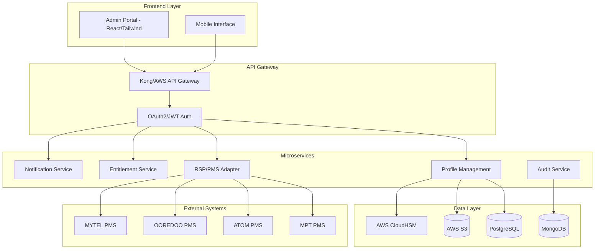

# NexoraSIM™ eSIM Profile Management Portal

Production-ready, standards-compliant eSIM management system for Myanmar telecom operators (MPT, ATOM, OOREDOO, MYTEL).

## 🏗️ Architecture Overview



## 🚀 Quick Start

### Prerequisites
- Node.js 18+
- Docker & Docker Compose
- AWS CLI configured
- kubectl for Kubernetes

### Local Development
```bash
git clone https://github.com/nexorasim/management.git
cd management
npm install
docker-compose up -d
npm run dev
```

### Production Deployment
```bash
# Deploy to AWS EKS
kubectl apply -f k8s/
helm install nexorasim ./helm-chart
```

## 📊 Features

- ✅ 200+ eSIM profile management across 4 carriers
- ✅ RBAC with Admin/Operator/Auditor roles
- ✅ Full audit trail (GSMA SGP.22/SGP.29 compliant)
- ✅ Myanmar Unicode + English localization
- ✅ Multi-tenant carrier isolation
- ✅ CSV profile migration with validation
- ✅ Real-time analytics dashboard
- ✅ FIPS 140-3 Level 3 HSM integration
- ✅ SAS-SM v3.4.2 certification ready

## 🔐 Security & Compliance

- **Standards**: GSMA SGP.22, SGP.29, SAS-SM v3.4.2
- **Encryption**: TLS 1.3, AWS CloudHSM (FIPS 140-3 Level 3)
- **Certification**: Common Criteria EAL6+
- **Compliance**: ISO 27001, GDPR, Myanmar Data Protection

## 🏢 Multi-Tenant Architecture

Each carrier operates in isolated environments:
- MPT: Tenant ID `mpt-mm`
- ATOM: Tenant ID `atom-mm`  
- OOREDOO: Tenant ID `ooredoo-mm`
- MYTEL: Tenant ID `mytel-mm`

## 📈 Scalability

- **Capacity**: 100,000+ active eSIM profiles
- **Availability**: 99.99% SLA with multi-region deployment
- **Performance**: <100ms API response time
- **Auto-scaling**: Kubernetes HPA based on CPU/memory

## 🔧 Technology Stack

### Backend
- **Framework**: NestJS (Node.js)
- **Database**: PostgreSQL (primary), MongoDB (logs)
- **Cache**: Redis
- **Message Queue**: Apache Kafka
- **API**: GraphQL + REST

### Frontend
- **Framework**: React 18 + TypeScript
- **Styling**: Tailwind CSS
- **State**: Redux Toolkit
- **Charts**: Chart.js
- **i18n**: react-i18next

### Infrastructure
- **Cloud**: AWS (EKS, RDS, S3, CloudFront)
- **Monitoring**: Prometheus, Grafana, ELK
- **CI/CD**: GitLab CI/CD
- **Security**: AWS IAM, Secrets Manager, CloudHSM

## 📋 API Documentation

- **Swagger UI**: https://api.nexorasim.com/docs
- **GraphQL Playground**: https://api.nexorasim.com/graphql
- **Postman Collection**: `./docs/postman/`

## 🧪 Testing

```bash
# Unit tests
npm run test

# Integration tests  
npm run test:e2e

# Load testing
npm run test:load

# Security testing
npm run test:security
```

## 📊 Monitoring & Analytics

- **Dashboards**: Grafana (http://monitoring.nexorasim.com)
- **Logs**: ELK Stack (http://logs.nexorasim.com)
- **Alerts**: PagerDuty integration
- **Metrics**: Prometheus + OpenTelemetry

## 🌍 Localization

Supported languages:
- **English** (en-US)
- **Myanmar Unicode** (my-MM)

Translation files: `./frontend/src/locales/`

## 🔄 CI/CD Pipeline

GitLab CI/CD stages:
1. **Build** - Docker image creation
2. **Test** - Unit/integration/security tests
3. **Deploy** - Blue-green deployment to EKS
4. **Monitor** - Health checks and rollback

## 📞 Support

- **Documentation**: https://docs.nexorasim.com
- **Jira**: https://nexorasim.atlassian.net
- **Email**: support@nexorasim.com
- **Website**: https://www.nexorasim.com

## 📄 License

Proprietary - NexoraSIM™ 2024. All rights reserved.