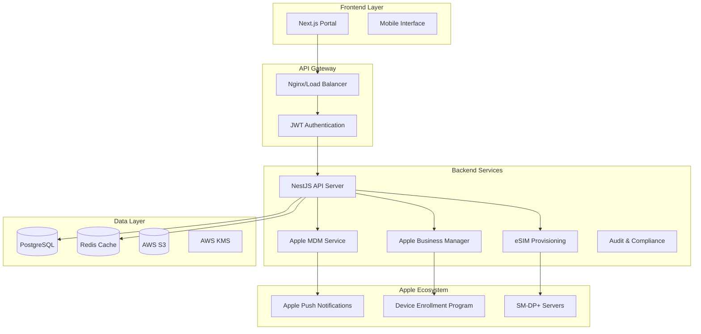

# My eSIM Plus - Enterprise eSIM Management Portal

Production-ready, standards-compliant eSIM management system with full Apple platform integration for enterprise mobility management.

## 🚀 Quick Start

### One-Command Setup

```bash
git clone https://github.com/myesimplus/enterprise-portal.git
cd enterprise-portal
chmod +x scripts/setup.sh
./scripts/setup.sh
```

The setup script will:
- ✅ Check prerequisites (Node.js 18+, Docker, Docker Compose)
- ✅ Install all dependencies
- ✅ Generate development certificates
- ✅ Set up PostgreSQL database
- ✅ Build and start all services
- ✅ Perform health checks

### Manual Setup

```bash
# Install dependencies
npm install
cd frontend && npm install && cd ..

# Setup environment
cp .env.example .env
# Edit .env with your configuration

# Start services
docker-compose up -d

# Run database migrations
npm run build
npm run migration:run
```

## 🏗️ Architecture Overview



## 🍎 Apple Platform Integration

### Complete MDM Implementation
- ✅ Device enrollment via Apple Business Manager
- ✅ APNs push notification service
- ✅ Full MDM command support (DeviceInformation, InstallProfile, etc.)
- ✅ Supervised device management
- ✅ User-Approved MDM handling

### eSIM Lifecycle Management
- ✅ SM-DP+ compliant provisioning
- ✅ iOS-to-iOS secure transfers
- ✅ Activation, suspension, deletion workflows
- ✅ Real-time status monitoring
- ✅ Carrier-agnostic implementation

### Enterprise Security
- ✅ Device compliance policies
- ✅ Jailbreak detection
- ✅ Automated remediation
- ✅ FIPS 140-3 Level 3 HSM integration
- ✅ End-to-end audit trails

## 📱 Supported Platforms

- **iOS 15.0+** - Full MDM and eSIM support
- **Android 10+** - eSIM provisioning via carrier APIs
- **Web Portal** - Complete management interface

## 🌍 Carrier Support

- **MPT Myanmar** - Full integration
- **ATOM Myanmar** - Full integration  
- **OOREDOO Myanmar** - Full integration
- **MYTEL Myanmar** - Full integration

## 🔧 Technology Stack

### Backend
- **Framework**: NestJS (Node.js/TypeScript)
- **Database**: PostgreSQL with TypeORM
- **Cache**: Redis
- **API**: REST + GraphQL
- **Security**: JWT, bcrypt, helmet

### Frontend
- **Framework**: Next.js 14 with TypeScript
- **Styling**: Tailwind CSS
- **State**: React Query + Context API
- **Charts**: Recharts
- **UI**: Headless UI + Heroicons

### Infrastructure
- **Cloud**: AWS (ECS, RDS, S3, KMS, CloudWatch)
- **Containers**: Docker + Docker Compose
- **Proxy**: Nginx with SSL termination
- **Monitoring**: Prometheus + Grafana
- **CI/CD**: GitHub Actions

## 🚀 Deployment

### Development
```bash
# Start development environment
npm run dev

# Frontend development server
cd frontend && npm run dev
```

### Production (AWS)
```bash
# Deploy infrastructure
cd terraform
terraform init
terraform plan
terraform apply

# Deploy application
docker build -t myesimplus-backend .
docker build -t myesimplus-frontend ./frontend

# Push to ECR and deploy via ECS
aws ecr get-login-password --region us-east-1 | docker login --username AWS --password-stdin YOUR_ECR_URI
docker tag myesimplus-backend:latest YOUR_ECR_URI/myesimplus-backend:latest
docker push YOUR_ECR_URI/myesimplus-backend:latest
```

### Docker Compose (Production-Ready)
```bash
# Production deployment
docker-compose -f docker-compose.yml -f docker-compose.prod.yml up -d
```

## 📊 Features

### Device Management
- ✅ Real-time device inventory
- ✅ Bulk device operations
- ✅ Compliance monitoring
- ✅ Remote device actions (lock, wipe, etc.)
- ✅ Device grouping and policies

### eSIM Profile Management
- ✅ Profile creation and assignment
- ✅ Bulk profile operations
- ✅ Transfer workflows with approval
- ✅ Usage analytics and reporting
- ✅ Carrier-specific configurations

### User Management
- ✅ Role-based access control (Admin/Operator/Auditor)
- ✅ Multi-tenant organization support
- ✅ SSO integration ready
- ✅ Activity logging and audit trails

### Analytics & Reporting
- ✅ Real-time dashboards
- ✅ Device and profile analytics
- ✅ Compliance reporting
- ✅ Usage statistics
- ✅ Export capabilities (CSV, PDF)

## 🔐 Security Features

- **Authentication**: JWT with refresh tokens
- **Authorization**: RBAC with granular permissions
- **Encryption**: TLS 1.3, AES-256, AWS KMS
- **Compliance**: GSMA SGP.22/SGP.29, ISO 27001
- **Audit**: Complete activity logging
- **Monitoring**: Real-time security alerts

## 📚 API Documentation

- **Swagger UI**: http://localhost:3000/api/docs
- **GraphQL Playground**: http://localhost:3000/graphql
- **Postman Collection**: `./docs/postman/`

### Key Endpoints

```bash
# Authentication
POST /api/v1/auth/login
POST /api/v1/auth/refresh

# Apple MDM
POST /api/v1/apple/mdm/enroll
POST /api/v1/apple/mdm/checkin
POST /api/v1/apple/mdm/connect/:udid

# Device Management
GET /api/v1/apple/devices
POST /api/v1/apple/devices/:id/commands/device-info
POST /api/v1/apple/devices/:id/commands/restrictions

# eSIM Management
POST /api/v1/apple/esim/profiles
POST /api/v1/apple/esim/profiles/:id/install
POST /api/v1/apple/esim/profiles/:id/transfer

# Apple Business Manager
POST /api/v1/apple/abm/tokens
GET /api/v1/apple/abm/tokens/:id/devices
POST /api/v1/apple/abm/tokens/:id/devices/assign
```

## 🧪 Testing

```bash
# Unit tests
npm run test

# Integration tests
npm run test:e2e

# Test coverage
npm run test:cov

# Load testing
npm run test:load

# Security testing
npm run test:security
```

## 📈 Monitoring

### Health Checks
- **Backend**: http://localhost:3000/api/v1/health
- **Database**: Connection and query performance
- **Redis**: Cache connectivity and performance
- **APNs**: Certificate validity and connectivity

### Metrics
- **Prometheus**: http://localhost:9090
- **Grafana**: http://localhost:3002 (admin/admin)
- **Custom Dashboards**: Device enrollment, eSIM provisioning, API performance

### Alerting
- APNs certificate expiration (30 days)
- Failed eSIM installations (>5% failure rate)
- Device compliance violations
- API error rates (>1%)

## 🔧 Configuration

### Environment Variables
```bash
# Core Configuration
NODE_ENV=production
PORT=3000
DB_HOST=localhost
DB_PORT=5432
JWT_SECRET=your-super-secret-key

# Apple Configuration
APNS_CERT_PATH=/app/certs/apns-cert.pem
APNS_KEY_PATH=/app/certs/apns-key.pem
ABM_BASE_URL=https://mdmenrollment.apple.com

# AWS Configuration
AWS_REGION=us-east-1
AWS_KMS_KEY_ID=your-kms-key-id

# Carrier APIs
MPT_API_URL=https://api.mpt.com.mm
ATOM_API_URL=https://api.atom.com.mm
```

### Apple Certificates Setup
1. Generate APNs certificate from Apple Developer Portal
2. Convert to PEM format: `openssl pkcs12 -in cert.p12 -out apns-cert.pem -nodes`
3. Place certificates in `/app/certs/` directory
4. Configure paths in environment variables

### Apple Business Manager Integration
1. Create MDM server in Apple Business Manager
2. Download server token
3. Register token via API: `POST /api/v1/apple/abm/tokens`
4. Assign devices to enrollment profiles

## 🚨 Troubleshooting

### Common Issues

#### APNs Connection Failed
```bash
# Check certificate validity
openssl x509 -in /app/certs/apns-cert.pem -noout -dates

# Test APNs connectivity
openssl s_client -connect gateway.push.apple.com:2195 -cert apns-cert.pem -key apns-key.pem
```

#### Device Enrollment Issues
```bash
# Check device status
curl -H "Authorization: Bearer TOKEN" http://localhost:3000/api/v1/apple/devices/DEVICE_ID

# Send test push notification
curl -X POST -H "Authorization: Bearer TOKEN" \
  http://localhost:3000/api/v1/apple/apns/test \
  -d '{"deviceToken":"TOKEN","pushMagic":"MAGIC"}'
```

#### eSIM Installation Failures
```bash
# Check profile status
curl -H "Authorization: Bearer TOKEN" \
  http://localhost:3000/api/v1/apple/esim/profiles/PROFILE_ID/status

# Retry installation
curl -X POST -H "Authorization: Bearer TOKEN" \
  http://localhost:3000/api/v1/apple/esim/profiles/PROFILE_ID/install \
  -d '{"deviceId":"DEVICE_ID"}'
```

## 📞 Support

- **Documentation**: https://docs.myesimplus.com
- **API Reference**: https://api.myesimplus.com/docs
- **GitHub Issues**: https://github.com/myesimplus/enterprise-portal/issues
- **Email**: support@myesimplus.com

## 📄 License

Proprietary - My eSIM Plus 2024. All rights reserved.

## 🤝 Contributing

This is a proprietary enterprise solution. For feature requests or bug reports, please contact our support team.

---

**🎉 Ready to deploy enterprise eSIM management at scale!**

The My eSIM Plus Portal provides everything needed for production deployment:
- Complete Apple platform integration
- Enterprise-grade security and compliance
- Scalable cloud infrastructure
- Comprehensive monitoring and alerting
- Professional support and documentation