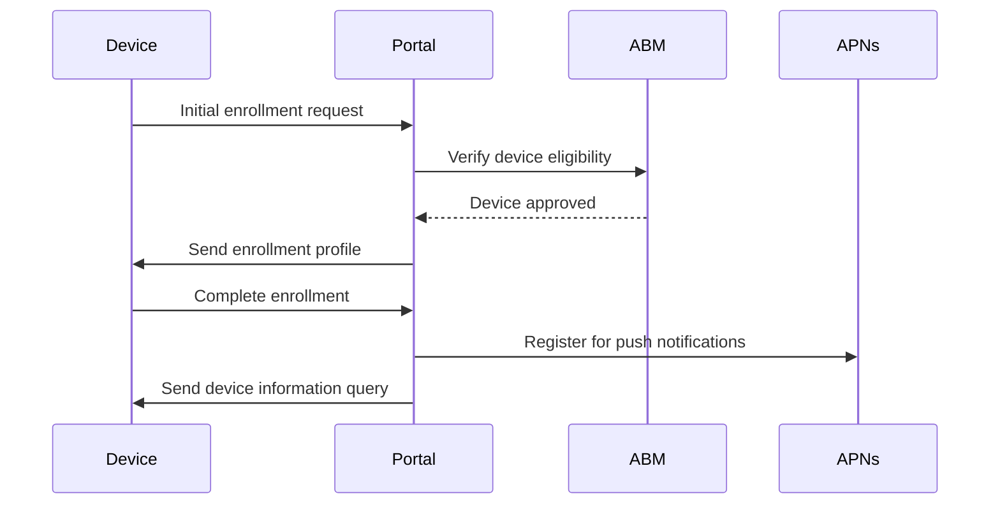

# Apple Platform Integration Guide

This guide provides comprehensive instructions for integrating My eSIM Plus with Apple's ecosystem, including MDM, ABM, and eSIM provisioning.

## Table of Contents

1. [Apple Business Manager (ABM) Setup](#apple-business-manager-abm-setup)
2. [Apple Push Notification Service (APNs) Configuration](#apple-push-notification-service-apns-configuration)
3. [Mobile Device Management (MDM) Implementation](#mobile-device-management-mdm-implementation)
4. [eSIM Provisioning Workflows](#esim-provisioning-workflows)
5. [Device Compliance and Security](#device-compliance-and-security)
6. [Troubleshooting](#troubleshooting)

## Apple Business Manager (ABM) Setup

### Prerequisites

1. Apple Business Manager account with Device Enrollment Program access
2. Valid Apple Developer Program membership
3. SSL certificates for secure communication

### Step 1: Create MDM Server in ABM

1. Log in to Apple Business Manager (business.apple.com)
2. Navigate to Settings > Device Management Settings
3. Click "Add MDM Server"
4. Fill in server details:
   - Server Name: "My eSIM Plus MDM"
   - Server URL: `https://your-domain.com/api/v1/apple/mdm`
   - Upload your MDM signing certificate

### Step 2: Generate Server Token

```bash
# Download the server token from ABM
# The token file will be named something like: server_tokens_your_org_id.p7m

# Extract the token using OpenSSL
openssl smime -verify -in server_tokens_your_org_id.p7m -inform DER -noverify -out server_token.json

# Register the token in the portal
curl -X POST https://your-domain.com/api/v1/apple/abm/tokens \
  -H "Authorization: Bearer YOUR_JWT_TOKEN" \
  -H "Content-Type: application/json" \
  -d '{
    "orgId": "YOUR_ORG_ID",
    "orgName": "Your Organization",
    "serverToken": "EXTRACTED_TOKEN_CONTENT",
    "consumerKey": "YOUR_CONSUMER_KEY",
    "consumerSecret": "YOUR_CONSUMER_SECRET"
  }'
```

### Step 3: Device Assignment

```javascript
// Assign devices to MDM profile
const assignDevice = async (tokenId, serialNumber, profileUuid) => {
  const response = await fetch('/api/v1/apple/abm/tokens/${tokenId}/devices/assign', {
    method: 'POST',
    headers: {
      'Authorization': `Bearer ${token}`,
      'Content-Type': 'application/json',
    },
    body: JSON.stringify({
      deviceSerialNumber: serialNumber,
      profileUuid: profileUuid,
    }),
  });
  
  return response.json();
};
```

## Apple Push Notification Service (APNs) Configuration

### Step 1: Create APNs Certificate

1. Log in to Apple Developer Portal
2. Navigate to Certificates, Identifiers & Profiles
3. Create a new certificate for "Apple Push Notification service SSL"
4. Download the certificate and convert to PEM format:

```bash
# Convert .p12 to PEM format
openssl pkcs12 -in apns_certificate.p12 -out apns-cert.pem -nodes

# Extract private key
openssl pkcs12 -in apns_certificate.p12 -nocerts -out apns-key.pem -nodes

# Verify certificate
openssl x509 -in apns-cert.pem -text -noout
```

### Step 2: Configure APNs in Application

```typescript
// APNs Service Configuration
const apnsOptions = {
  cert: fs.readFileSync('/app/certs/apns-cert.pem'),
  key: fs.readFileSync('/app/certs/apns-key.pem'),
  production: process.env.NODE_ENV === 'production',
  topic: 'com.apple.mgmt.External',
};

// Send push notification
const sendMDMPush = async (deviceToken: string, pushMagic: string) => {
  const notification = new apn.Notification();
  notification.topic = 'com.apple.mgmt.External';
  notification.pushType = 'mdm';
  notification.mdm = pushMagic;
  
  return provider.send(notification, deviceToken);
};
```

### Step 3: Certificate Renewal Automation

```bash
#!/bin/bash
# Certificate renewal script

# Backup existing certificates
cp /app/certs/apns-cert.pem /app/certs/backup/apns-cert-$(date +%Y%m%d).pem
cp /app/certs/apns-key.pem /app/certs/backup/apns-key-$(date +%Y%m%d).pem

# Install new certificates
cp /path/to/new/apns-cert.pem /app/certs/apns-cert.pem
cp /path/to/new/apns-key.pem /app/certs/apns-key.pem

# Restart APNs service
curl -X POST https://your-domain.com/api/v1/apple/apns/certificates/renew \
  -H "Authorization: Bearer YOUR_ADMIN_TOKEN" \
  -d '{"certPath": "/app/certs/apns-cert.pem", "keyPath": "/app/certs/apns-key.pem"}'
```

## Mobile Device Management (MDM) Implementation

### Device Enrollment Flow



### MDM Command Examples

#### Device Information Query

```typescript
const queryDeviceInfo = async (deviceId: string) => {
  const command = {
    RequestType: 'DeviceInformation',
    Queries: [
      'UDID', 'DeviceName', 'OSVersion', 'Model', 'SerialNumber',
      'IMEI', 'EID', 'IsSupervised', 'IsActivationLockEnabled'
    ],
  };
  
  return mdmService.sendCommand(deviceId, command);
};
```

#### Install eSIM Profile

```typescript
const installESIMProfile = async (deviceId: string, profileData: any) => {
  const payload = {
    PayloadType: 'com.apple.cellular',
    PayloadIdentifier: `com.myesimplus.esim.${profileData.id}`,
    PayloadUUID: profileData.id,
    PayloadDisplayName: `${profileData.carrier} eSIM`,
    CellularData: [{
      SMDP: profileData.smdpAddress,
      ICCID: profileData.iccid,
      PIN: profileData.confirmationCode,
    }],
  };
  
  const command = {
    RequestType: 'InstallProfile',
    Payload: Buffer.from(createMobileConfigXML(payload)).toString('base64'),
  };
  
  return mdmService.sendCommand(deviceId, command);
};
```

#### Apply Device Restrictions

```typescript
const applyRestrictions = async (deviceId: string) => {
  const restrictions = {
    allowAppInstallation: false,
    allowCamera: true,
    allowScreenShot: false,
    allowVoiceDialing: true,
    allowSafari: false,
    allowYouTube: false,
    allowITunes: false,
    allowGlobalBackgroundFetchWhenRoaming: false,
  };
  
  const command = {
    RequestType: 'Settings',
    Settings: [{
      Item: 'Restrictions',
      Restrictions: restrictions,
    }],
  };
  
  return mdmService.sendCommand(deviceId, command);
};
```

## eSIM Provisioning Workflows

### Standard eSIM Installation

```typescript
const provisionESIM = async (deviceId: string, carrierProfile: any) => {
  try {
    // Step 1: Create eSIM profile record
    const profile = await esimService.createProfile({
      deviceId,
      carrier: carrierProfile.carrier,
      plan: carrierProfile.plan,
      smdpAddress: carrierProfile.smdpAddress,
      activationCode: carrierProfile.activationCode,
      confirmationCode: carrierProfile.confirmationCode,
    });
    
    // Step 2: Install profile via MDM
    await installESIMProfile(deviceId, profile);
    
    // Step 3: Monitor installation status
    const installationStatus = await monitorInstallation(profile.id);
    
    // Step 4: Activate profile if installation successful
    if (installationStatus === 'installed') {
      await esimService.activateProfile(profile.id);
    }
    
    return profile;
  } catch (error) {
    console.error('eSIM provisioning failed:', error);
    throw error;
  }
};
```

### eSIM Transfer Between Devices

```typescript
const transferESIM = async (profileId: string, sourceDeviceId: string, targetDeviceId: string) => {
  const transferId = crypto.randomUUID();
  
  try {
    // Step 1: Validate transfer eligibility
    const profile = await esimService.getProfile(profileId);
    if (!profile.isTransferEligible) {
      throw new Error('Profile is not eligible for transfer');
    }
    
    // Step 2: Suspend profile on source device
    await esimService.suspendProfile(profileId);
    
    // Step 3: Remove profile from source device
    await mdmService.sendRemoveProfileCommand(sourceDeviceId, profile.identifier);
    
    // Step 4: Generate new activation code for target device
    const targetDevice = await deviceService.getDevice(targetDeviceId);
    const newActivationCode = await generateTransferActivationCode(profile, targetDevice.eid);
    
    // Step 5: Install on target device
    await esimService.updateProfile(profileId, {
      deviceId: targetDeviceId,
      activationCode: newActivationCode,
      transferId,
    });
    
    await installESIMProfile(targetDeviceId, { ...profile, activationCode: newActivationCode });
    
    // Step 6: Activate on target device
    await esimService.activateProfile(profileId);
    
    // Step 7: Log transfer completion
    await auditService.logTransfer({
      profileId,
      sourceDeviceId,
      targetDeviceId,
      transferId,
      status: 'completed',
    });
    
    return { transferId, status: 'completed' };
  } catch (error) {
    // Rollback on failure
    await esimService.updateProfile(profileId, {
      deviceId: sourceDeviceId,
      status: 'active',
    });
    
    await auditService.logTransfer({
      profileId,
      sourceDeviceId,
      targetDeviceId,
      transferId,
      status: 'failed',
      error: error.message,
    });
    
    throw error;
  }
};
```

## Device Compliance and Security

### Compliance Policy Engine

```typescript
const checkDeviceCompliance = async (deviceId: string) => {
  const device = await deviceService.getDevice(deviceId);
  const compliance = {
    isCompliant: true,
    violations: [],
    score: 100,
  };
  
  // Check OS version
  if (compareVersions(device.osVersion, '15.0') < 0) {
    compliance.isCompliant = false;
    compliance.violations.push({
      type: 'os_version',
      severity: 'high',
      message: 'iOS version below minimum requirement (15.0)',
      remediation: 'Update to iOS 15.0 or higher',
    });
    compliance.score -= 30;
  }
  
  // Check supervision status
  if (!device.isSupervised) {
    compliance.violations.push({
      type: 'supervision',
      severity: 'medium',
      message: 'Device is not supervised',
      remediation: 'Enroll device through Apple Business Manager',
    });
    compliance.score -= 20;
  }
  
  // Check jailbreak status
  if (device.securityInfo?.IsJailbroken) {
    compliance.isCompliant = false;
    compliance.violations.push({
      type: 'jailbreak',
      severity: 'critical',
      message: 'Device is jailbroken',
      remediation: 'Device must be restored to factory settings',
    });
    compliance.score -= 50;
  }
  
  // Check activation lock
  if (!device.deviceInformation?.IsActivationLockEnabled) {
    compliance.violations.push({
      type: 'activation_lock',
      severity: 'low',
      message: 'Activation Lock is disabled',
      remediation: 'Enable Activation Lock in device settings',
    });
    compliance.score -= 10;
  }
  
  return compliance;
};
```

### Automated Remediation

```typescript
const remediateComplianceViolations = async (deviceId: string, violations: any[]) => {
  for (const violation of violations) {
    switch (violation.type) {
      case 'restrictions':
        await mdmService.sendRestrictionsCommand(deviceId, getComplianceRestrictions());
        break;
        
      case 'passcode':
        await mdmService.sendClearPasscodeCommand(deviceId);
        break;
        
      case 'profiles':
        await removeNonCompliantProfiles(deviceId);
        break;
        
      case 'apps':
        await removeNonCompliantApps(deviceId);
        break;
        
      default:
        console.warn(`No automated remediation for violation type: ${violation.type}`);
    }
  }
};
```

## Troubleshooting

### Common Issues and Solutions

#### 1. APNs Connection Issues

```bash
# Test APNs connectivity
openssl s_client -connect gateway.push.apple.com:2195 -cert apns-cert.pem -key apns-key.pem

# Check certificate expiration
openssl x509 -in apns-cert.pem -noout -dates
```

#### 2. MDM Enrollment Failures

```typescript
// Debug enrollment issues
const debugEnrollment = async (udid: string) => {
  const device = await deviceService.getDeviceByUDID(udid);
  
  console.log('Device Status:', {
    enrollmentStatus: device.enrollmentStatus,
    lastSeen: device.lastSeen,
    pushToken: device.pushToken ? 'Present' : 'Missing',
    pushMagic: device.pushMagic ? 'Present' : 'Missing',
  });
  
  // Check pending commands
  const pendingCommands = await mdmService.getPendingCommands(udid);
  console.log('Pending Commands:', pendingCommands.length);
  
  // Test push notification
  if (device.pushToken && device.pushMagic) {
    try {
      await apnsService.sendPushNotification(device.pushToken, device.pushMagic);
      console.log('Push notification sent successfully');
    } catch (error) {
      console.error('Push notification failed:', error);
    }
  }
};
```

#### 3. eSIM Installation Failures

```typescript
// Debug eSIM installation
const debugESIMInstallation = async (profileId: string) => {
  const profile = await esimService.getProfile(profileId);
  
  console.log('Profile Status:', {
    status: profile.status,
    carrier: profile.carrier,
    smdpAddress: profile.smdpAddress,
    deviceId: profile.deviceId,
  });
  
  // Check SM-DP+ connectivity
  try {
    const smdpStatus = await testSMDPConnectivity(profile.smdpAddress);
    console.log('SM-DP+ Status:', smdpStatus);
  } catch (error) {
    console.error('SM-DP+ connectivity failed:', error);
  }
  
  // Check device EID
  if (profile.deviceId) {
    const device = await deviceService.getDevice(profile.deviceId);
    console.log('Device EID:', device.eid || 'Not available');
  }
};
```

### Monitoring and Alerting

```typescript
// Set up monitoring for critical operations
const setupMonitoring = () => {
  // Monitor APNs connection
  setInterval(async () => {
    const status = await apnsService.getConnectionStatus();
    if (!status.connected) {
      await alertService.sendAlert('APNs connection lost', 'critical');
    }
  }, 60000); // Check every minute
  
  // Monitor certificate expiration
  setInterval(async () => {
    const certStatus = await apnsService.validateCertificates();
    if (certStatus.expiresAt && isWithinDays(certStatus.expiresAt, 30)) {
      await alertService.sendAlert('APNs certificate expires soon', 'warning');
    }
  }, 86400000); // Check daily
  
  // Monitor failed eSIM installations
  setInterval(async () => {
    const failedInstallations = await esimService.getFailedInstallations();
    if (failedInstallations.length > 0) {
      await alertService.sendAlert(`${failedInstallations.length} eSIM installations failed`, 'high');
    }
  }, 300000); // Check every 5 minutes
};
```

This guide provides the foundation for implementing a production-ready Apple platform integration. For additional support, refer to Apple's official MDM documentation and the My eSIM Plus API documentation.