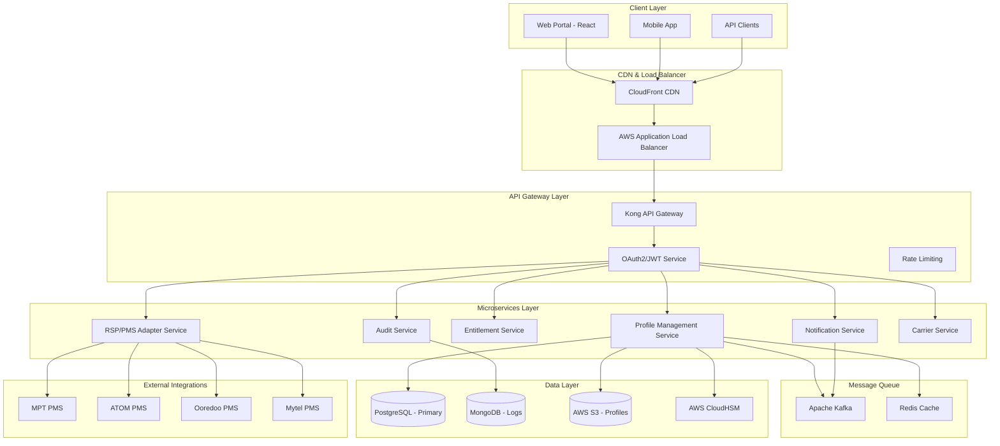

# NexoraSIM™ System Architecture

## Overview
Production-ready, standards-compliant eSIM management system for Myanmar telecom operators with GSMA RSP compliance, FIPS 140-3 Level 3 HSM integration, and Common Criteria EAL6+ certification.

## Architecture Diagram

## Component Details

### Frontend Layer
- **Technology**: React 18 + TypeScript + Tailwind CSS
- **Features**: Multi-tenant dashboards, RBAC, i18n (Myanmar/English)
- **Security**: CSP headers, XSS protection, HTTPS only

### Microservices

#### Profile Management Service
- **Responsibility**: eSIM profile lifecycle management
- **Database**: PostgreSQL (primary data)
- **Cache**: Redis (session, frequently accessed data)
- **Security**: HSM integration for cryptographic operations

#### RSP/PMS Adapter Service
- **Responsibility**: Integration with carrier PMS systems
- **Protocol**: GSMA RSP (SGP.22, SGP.29)
- **Certification**: SAS-SM v3.4.2 compliant
- **Security**: TLS 1.3, mutual authentication

### Security Architecture

#### Authentication & Authorization
- **Protocol**: OAuth2 + OpenID Connect
- **Tokens**: JWT with short expiration (15 minutes)
- **MFA**: TOTP, SMS, hardware tokens
- **RBAC**: Role-based access control with fine-grained permissions

#### Compliance
- **Standards**: GSMA SGP.22, SGP.29, ISO 27001, GDPR
- **Certification**: Common Criteria EAL6+
- **Auditing**: Continuous compliance monitoring

### Scalability & Performance

#### Horizontal Scaling
- **Capacity**: 100,000+ active eSIM profiles
- **Throughput**: 1,000+ API requests/second
- **Latency**: <100ms API response time
- **Availability**: 99.99% SLA with multi-region deployment